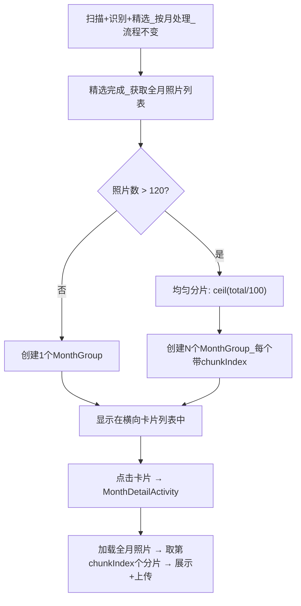

# 月份分片处理方案（纯展示层）

## 产品决策汇总


| 决策项   | 结论                                                                    |
| ----- | --------------------------------------------------------------------- |
| 方案类型  | **纯展示层分片** — 处理流程不变，只在展示和上传时拆分                                        |
| 分片规则  | > 120 张触发，目标 100 张/片，均匀分配                                             |
| 展示名称  | 非分片保持 "2026年02月"；分片用极简日期跨度，如 "2月5-12日"（今年省年份）/ "25年12月15-31日"（往年加短年份） |
| 排列顺序  | **最新分片排最前**                                                           |
| 精选范围  | **全月统一精选**（精选质量最优）                                                    |
| 分片稳定性 | 当前会话内卡片不变；退出重进后从 DB 重新加载、重新计算分片（可接受）                                  |


## 展示名称规则

- **未分片月份**（≤ 120 张）：保持现有格式 "2026年02月"（不变）
- **分片卡片**：极简日期跨度，日期升序（早→晚），"日"字只写末尾一次
  - 今年 + 不同日：**"2月5-12日"**（省略年份）
  - 今年 + 同日：**"2月12日"**
  - 往年 + 不同日：**"25年12月15-31日"**（加短年份前缀）
  - 往年 + 同日：**"25年12月15日"**

## 分片规则

- **≤ 120 张**：不拆分，保持单张卡片
- **> 120 张**：`numChunks = ceil(total / 100)`，照片按时间倒序排列后**均匀分配**到各分片
  - 例：250 张 → 3 片，每片 84 / 83 / 83 张
  - 例：200 张 → 2 片，每片 100 / 100 张
  - 例：121 张 → 2 片，每片 61 / 60 张

## 核心思路

**处理流程完全不变**（全月扫描 → 全月识别 → 全月精选），只在 ViewModel / UI 展示层将大月份的精选结果拆分成多张卡片。每张卡片独立展示、独立进入详情页、独立上传。

**DB 中 monthKey 保持 `yyyy-MM` 不变。** 分片只是展示层概念，不影响数据层。

## 数据流




## 需要修改的文件

### 1. [PhotoScanConfig.kt](feature/mobile/src/main/java/com/hk/phone_album/mobile/photoanalysis/config/PhotoScanConfig.kt) — 新增分片配置

```kotlin
/** 目标每片大小 */
const val MAX_PHOTOS_PER_CHUNK = 100

/** 拆分门槛：单月超过此数量才触发分片 */
const val CHUNK_SPLIT_THRESHOLD = 120
```

### 2. [PhotoUtils.kt](feature/mobile/src/main/java/com/hk/phone_album/mobile/photoanalysis/utils/PhotoUtils.kt) — 新增工具方法

- `splitIntoChunks(photos, maxPerChunk, threshold)` — 通用分片工具：按时间倒序排列后均匀分配，返回 `List<List<PhotoEntity>>`；若总数 ≤ threshold 则返回包含原列表的单元素列表
- `formatChunkDisplayName(chunkPhotos)` — 根据分片内照片的日期跨度生成极简展示名：今年省年份 "2月5-12日"，往年加短年份 "25年12月15-31日"，同日只显示一个日期 "2月12日"
- `formatMonthDisplayName(monthKey)` — 保持不变，用于非分片月份

### 3. [MonthGroup.kt](feature/mobile/src/main/java/com/hk/phone_album/mobile/photoanalysis/model/MonthGroup.kt) — 新增可选字段

```kotlin
val chunkIndex: Int? = null,    // 分片序号（从 0 开始），null 表示非分片
val totalChunks: Int? = null    // 该月总分片数
```

### 4. [PhotoAnalysisViewModel.kt](feature/mobile/src/main/java/com/hk/phone_album/mobile/photoanalysis/viewmodel/PhotoAnalysisViewModel.kt) — 展示层分片核心

- 精选完成后的 `loadCoverPhoto()` / `loadCoverPhotoWithoutSmartSelect()` / `loadAllMonthGroups()` 中：
  - 加载全月照片列表
  - 调用 `splitIntoChunks()` 判断是否需要分片
  - 如果需要分片：为每个 chunk 创建独立的 MonthGroup（带 chunkIndex、日期跨度 displayName、封面图）
  - 如果不需要：保持原有逻辑不变
- 排序逻辑：同一月份的分片按 chunkIndex ASC 排列（最新照片排最前）

### 5. [MonthDetailActivity.kt](feature/mobile/src/main/java/com/hk/phone_album/mobile/photoanalysis/ui/MonthDetailActivity.kt) — 传递分片参数

- 新增 `EXTRA_CHUNK_INDEX` 和 `EXTRA_TOTAL_CHUNKS` Extra
- 将 chunkIndex 传递给 MonthDetailViewModel

### 6. [MonthDetailViewModel.kt](feature/mobile/src/main/java/com/hk/phone_album/mobile/photoanalysis/viewmodel/MonthDetailViewModel.kt) — 按分片加载

- `loadMonthPhotos()` 加载全月照片后，如果有 chunkIndex 参数：
  - 调用 `splitIntoChunks()` 重新分片（与主页面使用相同逻辑，确保一致）
  - 只展示第 chunkIndex 个分片的照片
- 上传时也只上传该分片的照片（无需改上传逻辑，因为上传的是 ViewModel 中的 photos 列表）

## 不需要改动的文件

- **PhotoEntity** — monthKey 保持 `yyyy-MM`，不变
- **PhotoDao** — 不需要新增查询
- **PhotoRepository** — 扫描、识别、精选流程不变
- **PhotoRecognitionManager** — 不变
- **MonthAdapter** — 不需要改（它只读 MonthGroup 的 displayName 和 coverPhotoUri）
- **上传逻辑（UploadImageTask / BaseUploadTask）** — 不变（给什么照片上传什么）
- **PhotoAnalysisFragment** — 不需要改（它通过 MonthGroup.monthKey 导航到详情页，只需额外传 chunkIndex）

